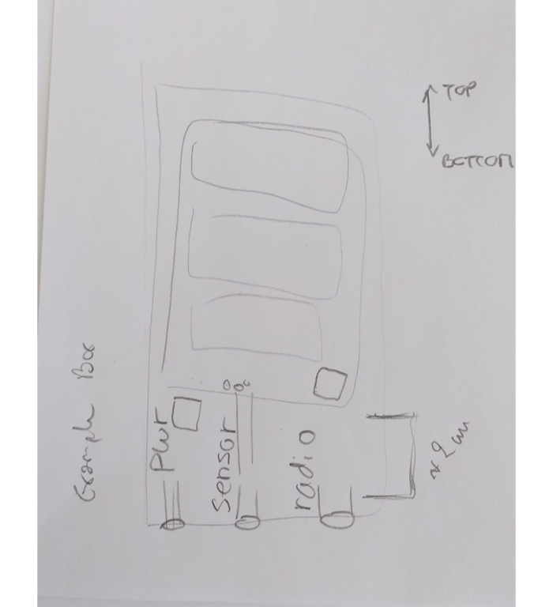

```{r setup, include=FALSE}
knitr::opts_chunk$set(echo = TRUE)
```

## Notes

- Note: Naichen worked about 5 hrs for the project
- Com box on 9V -> 5V -> **3V**
  - Note: the raspberry pi work on 5V.
- Sensors's box on 5V
  - The resolution of the sensors is higher
- Define radio connectors for the LoRa module
  - [Antenna](https://www.sirioantenne.it/en/products/cellular/cx-840-cx-900)
  - SMA cable go-through (PCB to box wall) and male to male (box to antenna)
    - https://www.amazon.com/Superbat-Connectors-Coaxial-Connector-Vertical/dp/B09V6ZY1PH/ref=sr_1_10?crid=9IB0SP6IKHYZ&keywords=SMA%2Bfemale&qid=1664312376&qu=eyJxc2MiOiI0LjQ3IiwicXNhIjoiNC40OCIsInFzcCI6IjQuMjgifQ%3D%3D&sprefix=sma%2Bfemal%2Caps%2C164&sr=8-10&th=1
    - https://www.amazon.com/DHT-Electronics-coaxial-assembly-bulkhead/dp/B00COXZ2RM
    - https://www.amazon.com/dp/B07V72Q23H/ref=syn_sd_onsite_desktop_102?ie=UTF8&pd_rd_plhdr=t&th=1
- Define radio go-through connectors
- Radio box specs
- Sensors' box specs
  - Naichen: instead of changing sensors in the box, replace the whole sensors' box. This idea actually make a lot of sense: sensors's box are given to the user for mounting; when aged the box is returned and sensors replaced by "manifacture" while a new sensors' box is provided. 
  
## Com box draw


